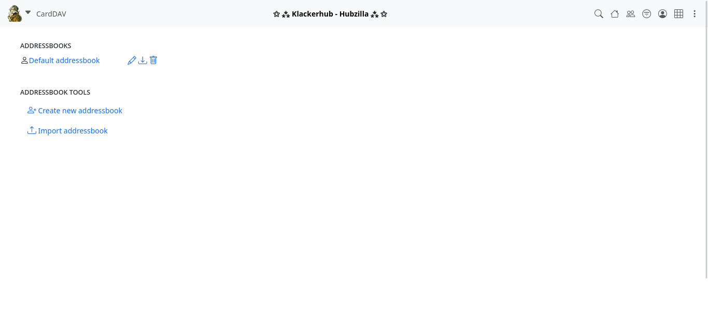
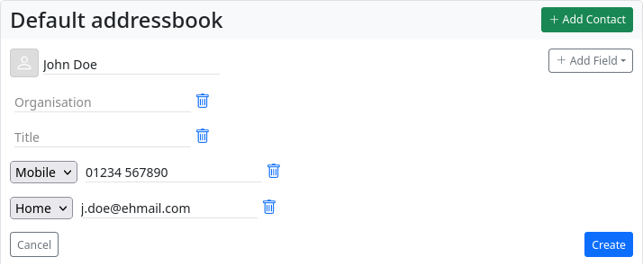
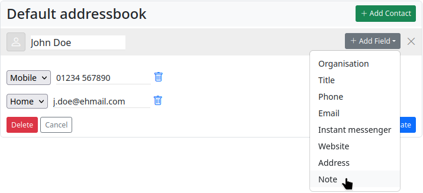
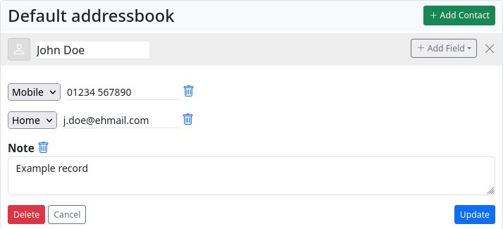
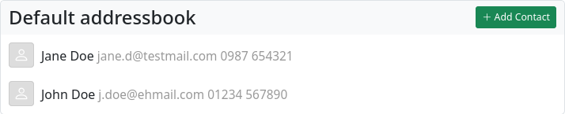
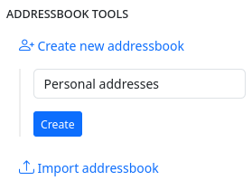
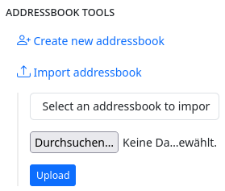

### **Address book (CardDAV)** 

Hubzilla offers you address management with the ‘CardDAV’ app. You can create as many address books as you like.

The entries are stored in vCards format.

The app also allows you to import address books or individual vCards from a file.

Address books are generally private and cannot be shared - not even via remote authorisation.