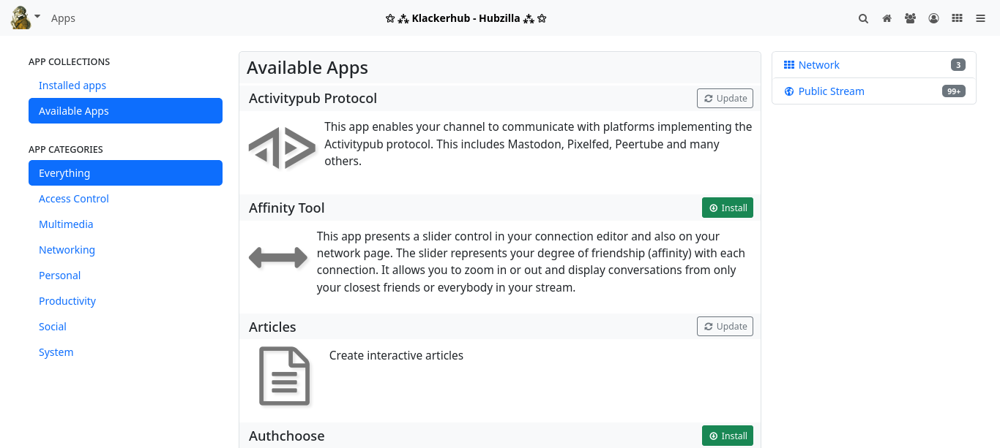
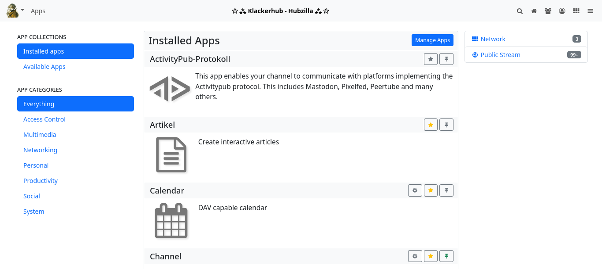
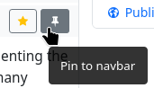
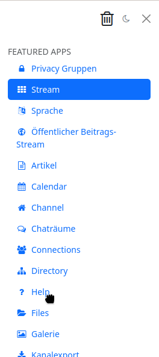

### Apps 

A freshly installed Hubzilla instance has a number of basic functionalities. However, there are many features that are not part of the basic installation and are not immediately available for a newly created channel.

The majority of functions are realised as ‘applications’ (or ‘apps’ for short).
You can access the apps using the ‘app menu’, which is symbolised by the ‘⋮’ button (and is located on the far right of the navigation bar on most hubs). You can also pin frequently used apps to the navigation bar so that you don't have to open the app menu every time you call them up.

How many and which apps are available to you depends on how the administrator has configured the hub.

#### App management 

You can manage the apps for your channel using app management. You can also access this in the app menu under the lowest menu item ‘+ Apps’

After calling up the app management, the apps already installed are displayed.

You can now switch between ‘Installed apps’ and ‘Available apps’ in the left-hand sidebar.

##### Available apps 

In the available apps, you will find all the apps available on your hub. Some of them are already installed. You can use the button next to the app to install apps or update apps that are already installed.

##### Installed apps 

The Installed apps tab contains all the apps that are installed for your channel. To the right of each app there are two or three buttons with icons: a star icon, a pinhead icon and, if applicable, a cogwheel icon.

The star symbol is used to make the app accessible as a menu item in the app menu.

You can pin the app in the navigation bar using the pin symbol.

If there is a dialogue for app-specific settings for an app, you can access this via the button with the cogwheel symbol.

##### Manage apps 

There is also a button labelled ‘Manage apps’ at the top of the installed apps tab. This button takes you to the ‘Manage apps’ page, where you can uninstall apps and also edit installed apps within certain limits.

It is also possible to create your own apps there (only for advanced users!).

##### Sorting apps in the menu 

You can easily sort the apps you have added to the app menu using drag-and-drop and specify your preferred order.

