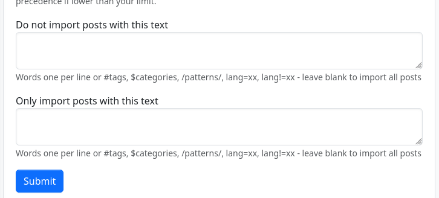
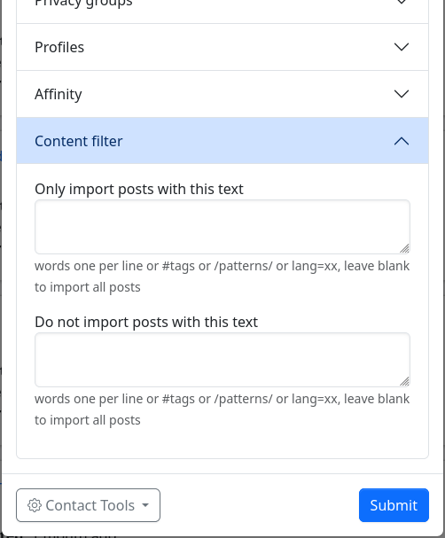

### Content Filters

Content Filter allows you to filter incoming content from all  sources or from specific connections. The filtering may be based on  words, tags, regular expressions, or language.

You can set global filters for all incoming content in the stream settings.

You can also set individual filters for each of your Connections. Select  "Edit" for any connection, then look under Content filter.

If you add filters under **Do not import posts with this text**, ("deny filtering") these are applied first. Any matching content will be removed.

Then, any filters under **Only import posts with this text** ("accept filtering") are applied. Only matching content will be kept, and everything that doesn't match will be removed.

Generally speaking, you will be using one or the other; and rarely if ever using both at the same time. 

#### Basic Filters

**TEXT**

Any text that **doesn't** start with one of the following: '#', '$', '?', '/', '@', 'lang=', 'lang!='
performs a case-insensitive text match.

Example: `apple` (matches "apple", "APPLE", "Apples", "pineapple", "applesauce", etc.)

Example: `low sub` (matches "low sub", "low sub-zero", "Yellow Submarine", etc.)

NOTE: Beware of using short character sequences that will match many  dissimilar words. You may want to use REGULAR EXPRESSIONS (see below).

**LANGUAGE**

**lang=**
Match language (if it can be identified)
Example: `lang=de` (matches German-language content)

**lang!=**
Match anything except this language (if it can be identified)
Example: `lang!=en` (matches non-English content)

**HASHTAG**

**\#**
Match hashtag
Example: `#cats`

**\#>n**
Match greater than total number of hashtags
Example: `#>10`

**MENTION**

**@**
Match mention
Example: `@alice`

**@>n**
Match greater than total number of mentions
Example: `@>10`

**CATEGORY**

**$**
Match category.
Example: `$Science`

**ITEMS AND FIELDS**

**?**
Discussed below under **Advanced Filters**

**REGULAR EXPRESSIONS (REGEX)**

**/**
Match a "regular expression". See numerous online help sites such as [Regular-Expressions.info](https://www.regular-expressions.info/) and [regexr.com](https://regexr.com/) for regex assistance.

Example: `/gr[ae]y/` (matches "gray" and "grey")
Example: `/\b[Ww]ar\b/` (matches the whole words "war" and "War", but not "wars", "warning", "software", etc.)

#### Advanced Filters

**ITEMS**

**?**
You may perform a string/numeric/array/boolean match on the database fields of an item (a post, comment, etc). A complete listing is beyond the  scope of this document, but see `install/schema_mysql.sql` and search for `CREATE TABLE IF NOT EXISTS `item``. Here is a sampling:

- `body` (content of the message)
- `verb` (usually the same as the ActivityPub activity type, e.g. Create, Listen)
- `obj_type` (usually the same as the ActivityPub object.type, e.g. Note, Event)
- `item_thread_top` (first post in a thread, boolean)
- `item_private` (0 = public message, 1 = restricted message, 2 = direct message)
- `ua` (User-Agent string of delivery agent - custom item attribute that is not in the database)
- ...etc...

Available comparison operators are:

- `?foo ~= baz` -- item.foo contains the string 'baz'
- `?foo == baz` -- item.foo is the string 'baz'
- `?foo != baz` -- item.foo is not the string 'baz'
- `?foo // regex` -- item.foo matches the regular expression 'regex' - automatically  wrapped in forward slashes unless you wrap it with some other character, for instance '=regex='.
- `?foo >= 3` -- item.foo is greater than or equal to 3
- `?foo > 3` -- item.foo is greater than 3
- `?foo <= 3` -- item.foo is less than or equal to 3
- `?foo < 3` -- item.foo is less than 3
- `?foo {} baz` -- 'baz' is an array element in item.foo
- `?foo {*} baz` -- 'baz' is an array key in item.foo
- `?foo` -- true condition for item.foo
- `?!foo` -- false condition for item.foo (The values 0, '', an empty array, and an unset value will all evaluate to false)

Example: `?verb == Announce` (matches ActivityPub "boosts")

**FIELDS**

**?+**
ActivityPub/ActivityStreams object match. This is literally the copied object attribute from the incoming activity.

Supports all the operators listed above. 

Examples: 

`?+type == Question` -- matches ActivityPub polls 

`?+attributedTo ~= spammer` -- matches ActivityPub attributedTo: https://o3r56t3c.example.com/u/cryptospammer2355