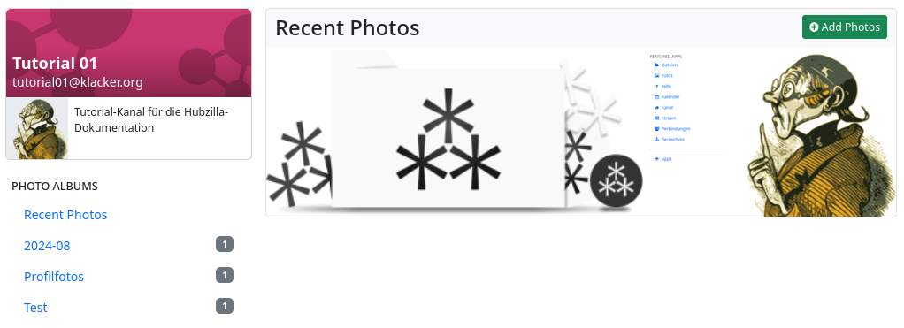
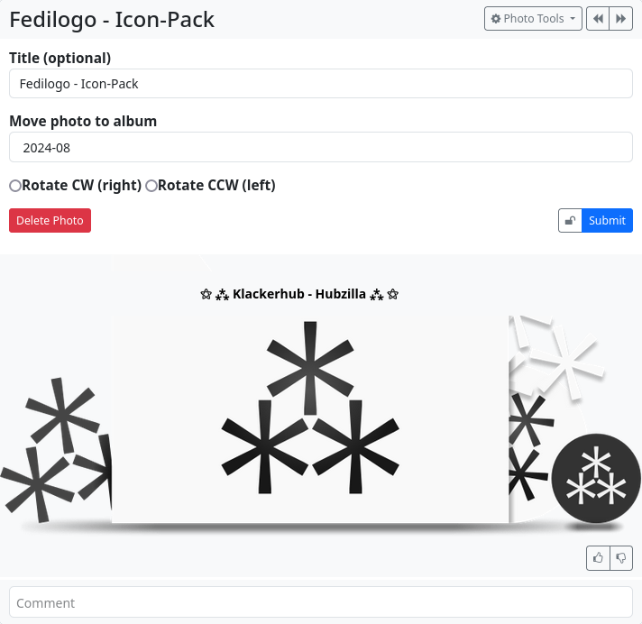

#### Photos

The Photos app is a special management/viewing tool for images uploaded to your own cloud. It displays thumbnails instead of tiles or file names, which makes it easier to find specific images.

Clicking on the image will take you to the image view. There are two control icons here to switch to the next or previous photo.

There is also a ‘Photo tools’ button that allows you to set the image as a profile picture or banner and to edit the image using a menu.

Clicking on the image again will open a full-size view.

