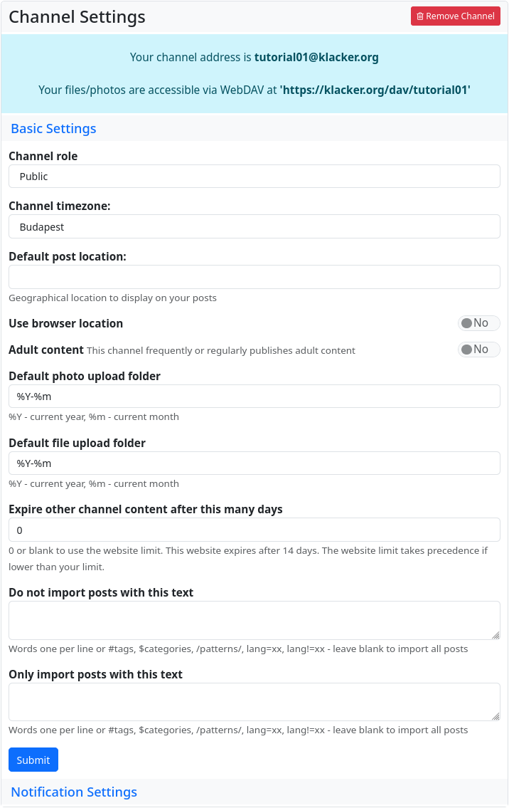
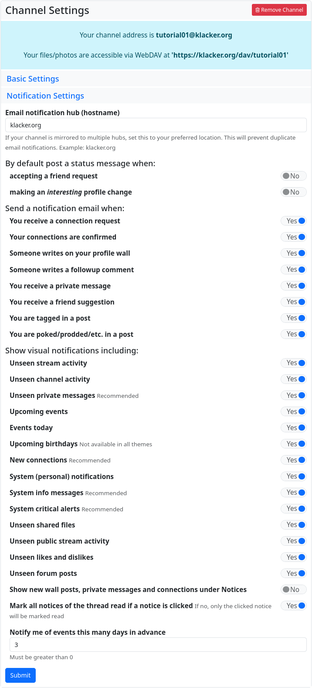

#### Channel settings

If you access the settings via the menu item, the channel settings are displayed by default. The basic settings are used to set the properties and functions of the currently selected (used) channel. In addition to the channel role, you can also define the standard for automatically created directories in the cloud (these are generated, for example, when you upload an image as an attachment in a post).

It is also possible to delete the channel (red ‘Delete channel’ button).

<u>Important note:</u> It is not possible to create a new channel on this hub under the name of the deleted channel (not even by cloning). This is to protect against ‘identity misuse’. If you still want to reinstall a channel with this name for important reasons, you can contact the admin of the hub, explain the reasons (so that they can be sure that you have a legitimate interest) and ask them to remove the block. Only he can do this with a few simple steps in the database.

You can also set the expiry period for imported content from other channels and control this import using two filters.

The notification settings allow you to specify exactly whether you want to be notified of certain events and actions. And whether you also want the notification to be sent by email.

