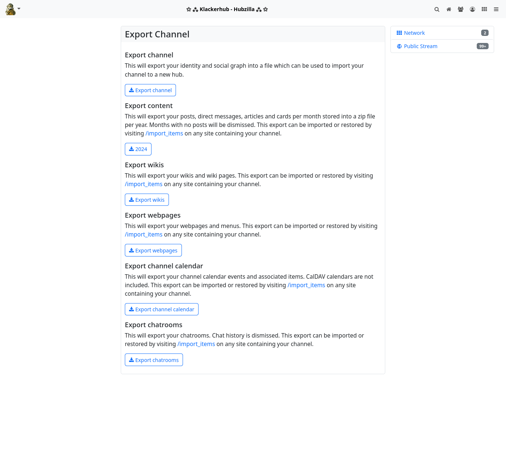
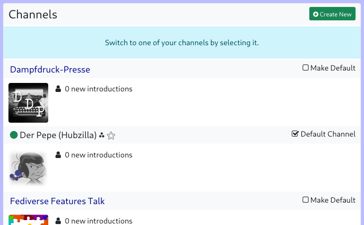
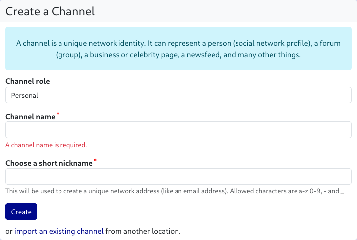
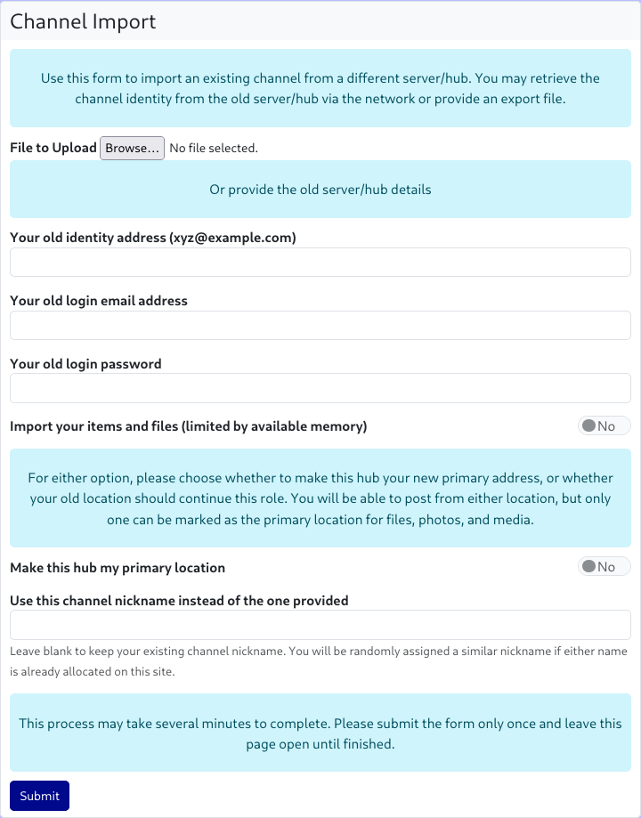

### Clone

Hubzilla channels have a so-called ‘nomadic identity’. This is a speciality of the Nomad protocol, on which Hubzilla is based and with which Hubzilla hubs communicate with each other.

The nomadic identity makes it possible to create clones of your own channel, which greatly increases your resistance to censorship and outages.

If you have cloned your channel, it is no problem if your ‘home hub’ fails or does not work correctly. You can seamlessly continue to participate in the Fediverse with a channel clone located on another hub.
All channel clones are automatically synchronised in the background.

To create a clone of your channel, you need an account on another Hubzilla hub.
There are now several ways to create a clone of your channel on this other hub.

You can use the ‘Channel Export’ app to export the channel on your ‘home hub’.

By clicking on the ‘Export channel’ button, you can export your identity and your social graph to a file that you can download.
Since files, websites, wikis, calendars and chat rooms are always restricted to your own hub (i.e. the respective server), you can also use the ‘Channel export’ app to download archives of this data locally.
Now log in to the new hub and either select the ‘Channels’ menu item in the main menu (your profile picture; top left) and then the ‘+ Create new’ button on the channel selection page that appears, or go directly to the channel creation page at `<URL-of-your-hub>/new_channel`.

On this page, however, you do not enter any information for creating a new channel, but instead select the link ‘import an existing channel from another server’ at the bottom of the dialogue.

The dialogue for importing the channel now opens.

Click on the ‘File to upload: Browse...’ button to open a file dialogue where you can select the previously saved channel file.

As an alternative to this method, you can also clone your channel directly from the source, i.e. the originating hub. To do this, you must enter the handle of the channel to be cloned, the e-mail address for logging in to the source hub, and the corresponding password in the channel import dialogue. In addition, you can use a switch to select whether files and objects from the source hub should also be imported (provided that your new hub allows this and the storage limit is sufficient).

In the dialogue, you can also specify whether the new hub should be your ‘primary hub’. This means that the new channel (the one you are now creating) will be your primary channel. This affects the handle of your channel, which will now end with the URL of the new hub.

As a rule, unless you want to move completely to a different hub, you leave the switch at ‘No’ and the primary hub remains the one it currently is (the handle remains unchanged).

If you would like a different channel name (short name), you can enter it in an additional input field. If you leave the field empty, the channel short name remains unchanged.

*Note: If the channel short name is already in use on the new hub (or has been blocked because an identical channel already existed there but was deleted), the system will automatically modify the short name.*

Finally, click on ‘Submit’ and do NOT leave the page until the import is complete. Depending on the size of the source channel, this may take some time.

You can manage your clones at any time via Settings → Manage clone addresses. You can define which is the ‘primary hub’ and you can delete clones, although it is recommended that you delete cloned channels directly on the respective hub.

