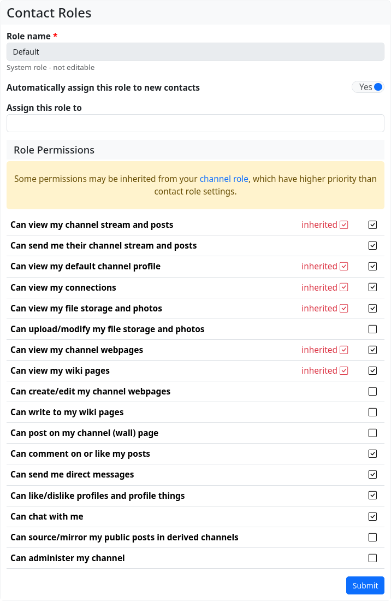
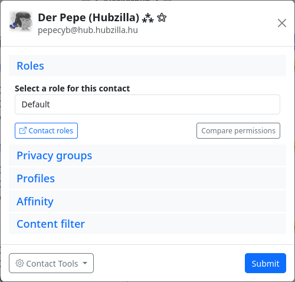

#### Permissions - Contact roles 

Contact roles are used to create roles (i.e. a collection of rights and options) for contacts. These roles can then be assigned to a contact or all contacts in a privacy group (not the group itself). This restricts or extends the possibilities of contacts.

The ‘Contact roles’ app can be used to create roles that correspond to the [channel roles](permissions_channel_roles.md). This permission role can then be assigned to individual contacts or all contacts in a privacy group in the contact editor or privacy group editor.

After creation, each channel automatically has the ‘Standard’ contact role (‘System role - not editable’). New contacts are automatically assigned this contact role (unless you create your own contact role, change this default setting and assign the new, customised role to new contacts in future). The default contact role includes authorisations based on the selected channel role. In addition to the rights granted by the channel role, some other rights are granted so that the channel behaves as you would expect based on the channel role (e.g. ‘Public’ is most similar to a ‘normal’ social network channel).

Note: Some of the rights of a channel role (whether standard or self-created) are inherited from the channel role. These rights cannot be revoked in the contact role. The contact role is a whitelist in which only additional rights can be granted.

You can assign a contact role to a contact in the [connection editor](connection_editor.md). This dialogue also appears when you add a new contact. By default, the contact role for which the ‘Automatically assign this role to new contacts’ switch has been activated is selected here.

For channels without self-defined contact roles, this is always ‘Standard’. There is also a ‘Contact Roles’ button in the connection editor which takes you to the contact role editor if you want to create a new contact role for the contact.