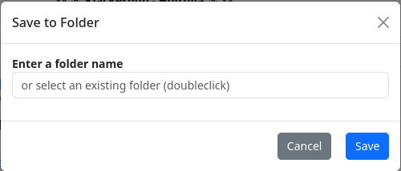
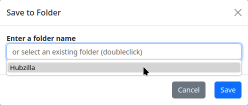
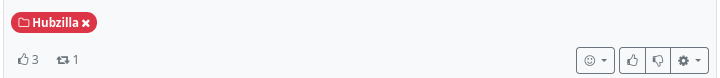
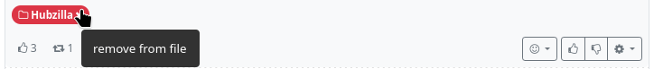

#### Save to folder 

If you want to remember postings for later, you can do this by [marking them](./toggle_star_status.md) (star). However, if you have a large number of postings marked in this way, it can easily become confusing.
It is more practical to save such posts in different ‘folders’. These are categorised markings.
If you select ‘Save in folder’, a dialogue window opens to select the folder.

You can enter a folder name in the text field. If folders already exist, a double click in the text field will display a selection list of the existing folders so that you can select one of them.

If you have placed a post in a folder, you can recognise this by the folder symbol (including folder name) at the bottom left of the post.

This icon can also be used to remove a post from a folder by clicking on the ‘X’ in the icon.

In the stream view, you will find the entry ‘Saved folders’ in the left sidebar. If you click on it, all existing folders are displayed. If you now select a folder, all the posts that you have saved in this folder will be displayed in (reverse) chronological order in the stream.
This feature is comparable to the ‘clips’ (= categorised bookmarks) as known from Misskey and the Forkeys.