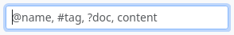
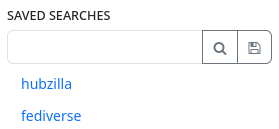

### Search

To quickly find information, you can use the search function.
To do so, click on the icon in the navigation bar.

This searches the entire hub. You can search for hashtags, handles and text.

In the channel view, there is also a search field in the left sidebar. It only searches the stream of your own channel. Searches that have been performed in this widget can also be saved by clicking on the floppy disc symbol next to the search field. The saved search is then displayed in a list of search terms below the search field and can be repeated at any time with a single click.

