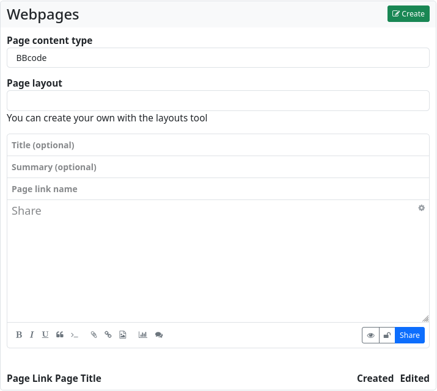
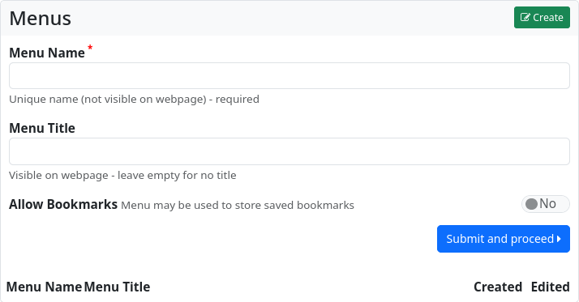
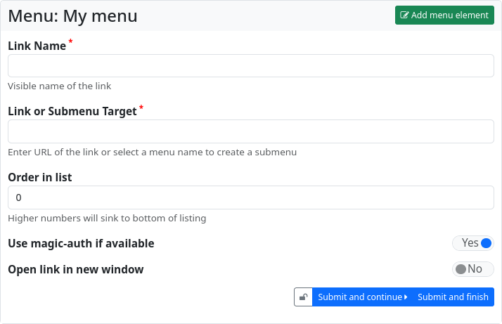
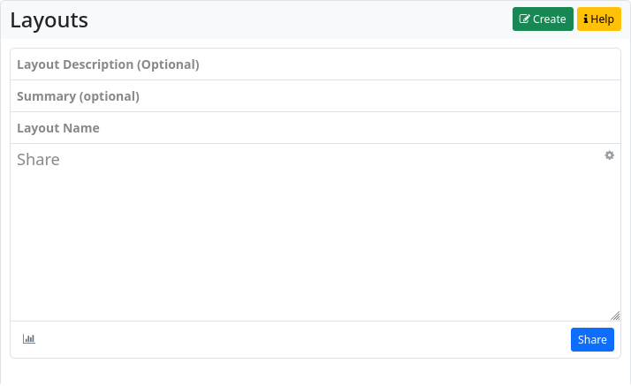

### Websites

The Websites app allows you to create static websites in your channel. Websites remain on your hub and are not federated. However, you can share the link to the website and enable all users in the Fediverse to visit your website.

When you open the app, you will be taken to the website overview. The pages will be accessible at `<your-instance-URL>/page/<your-channel-name>/<page-link-title>`.


In the left sidebar, there is a widget with the design tools for ‘blocks’, ‘menus’, ‘layouts’ and ‘pages’.
Below that, there is another widget that allows you to export and import web pages.

The centre section lists the existing web pages. You can edit, share and delete them. There is also a button to create a new web page: ‘Create’.

When you click on this button, the web page editor opens.



You now have the choice of how you want to design the website: with bbCode, with HTML, with Markdown, with plain text or with the Comanche layout language.

You can also specify which layout (if you have created one or more using the layout design tool) should be used to display the web page.

Next is the input field for the optional page title, as well as (also optional) a summary, and (mandatory) the page URL.

Below that is the text editor for the content of the website.

If you just want to create a very simple website with formatting and other markup elements, it is sufficient to create it in the website editor using plain text, HTML, bbCode or Markdown. This way you get a website without a special layout (without sidebars, without menus etc.).

For more sophisticated websites, it is recommended that you work with blocks, layouts and menus.

#### **Blocks**

Blocks can be parts of web pages. The basic HTML code of a block looks like this

```
  <div>
    block content
  </div>
```

If a block has the content type text/html, it can also contain menu items. The example content of

```
  <p>HTML block content</p> 
  [menu]menuname[/menu]
```

will produce HTML like this

```
  <div>
        <p>HTML block content</p>
<div>
<ul>
<li><a href=‘#’>Link 1</a></li>
<li><a href=‘#’>Link 2</a></li>
<li><a href=‘#’>Link 3</a></li>
</ul>
</div>
</p>
```

A block can also contain the actual content of the website via the `$content` macro.
To do this, create a block with only

```
  $content
```

as content.
For a block to appear on the website, it must be defined within a region in the page layout.

```
  [region=aside]
    [block]blockname[/block]
  [/region]
```

The appearance of the block can be manipulated in the page layout.
You can assign your own classes

```
    [region=aside]
   [block=myclass]blockname[/block]
  [/region]
```

will produce the following HTML

```
  <div class=‘myclass’>
    Block Content
  </div>
```

The wrap variable can be used to free a block from its enclosing `<div></div>`tag

```
  [region=aside]
   [block][var=wrap]none[/var]blockname[/block]
    [/region]
```

This HTML is generated

```
Block content
```

With the block editor, blocks can be created just as easily as web pages.


#### **Menus**

The menu editor is used to easily create navigation menus.



The menu must be assigned a unique name (this name can be used to reference it later in the website and in blocks). Entering a title is optional. You can also choose whether the menu is available for adding bookmarks. This feature makes it possible to add links marked as bookmarks from the stream to the menu with a single click.

Click ‘Submit and continue’ to create the menu.



The dialogue for adding a menu entry will now open. You must enter a name for the menu entry (‘Name of the link’) and the destination of the link. This can be a URL or the name of another menu (which is then integrated as a submenu).

You can influence the sorting of the menu entries by entering a number at ‘Order in list’.

If the URL is an external link to a source on another hub, you can ensure that you are authenticated at the target and that restricted content is available if necessary by setting the ‘Use Magic-Auth if available’ switch.

You can also specify whether links should open in a new window or tab.

Click on ‘Submit and proceed’ to create further entries. ‘Submit and finish’ ends the entry of menu items. Menus can, however, be edited and added to at any time.

#### **Layouts**

Layouts are used to define the general structure of web pages. They are designed using the Comanche page description language, a variant of bbCode. You have to give the layout a name. The definition of the layout is then entered in the text field. This is also where you can define the contents of the various regions.

