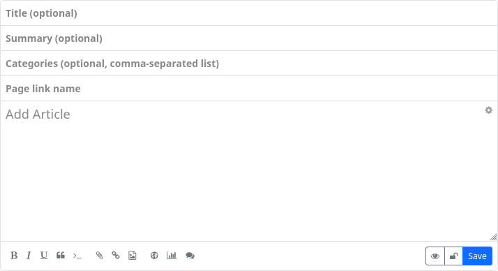
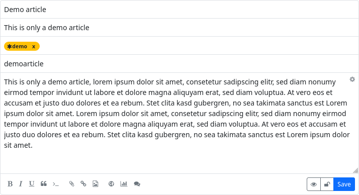
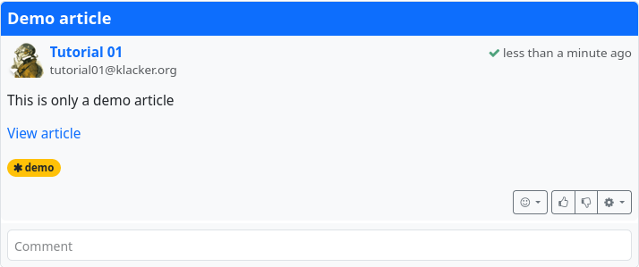
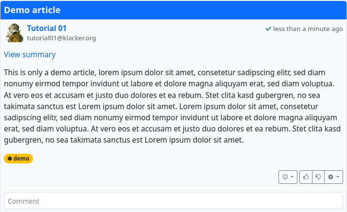
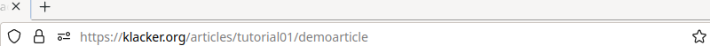

### Article

The article is a macroblogging post type at Hubzilla and is suitable for real blog posts, for example. Unlike normal posts, which are distributed throughout the entire network (including the Fediverse), articles remain on your own hub. They are only accessible to users of other instances and users who do not have an account in the Fediverse via their URL. Of course, the URL can be shared so that the article will still be known in the Fediverse and can be accessed.
You can create an article using the app (app menu ⋮) ‘Article’. When you open it, all created articles are displayed and you have the option to create a new article (‘Add article’).

Creating an article is similar to creating a normal post. However, the input form has an additional field: ‘Link to page’.

Here you can enter an easy-to-read link name. If you leave this field empty, a name will be assigned automatically (longer and more ‘cryptic’).

If you have filled in the optional ‘Summary’ field, only the summary of an article will initially be displayed, just like a normal post.

If you click on ‘View article’, the article itself will be displayed.

The direct link to the article is composed as follows:
`URL-of-your-hub/articles/channel-name/link-to-page`

