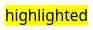
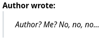
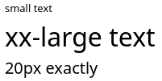
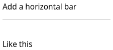
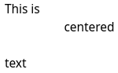
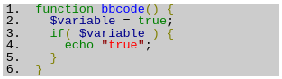
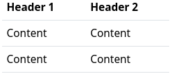
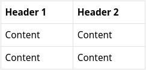
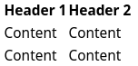
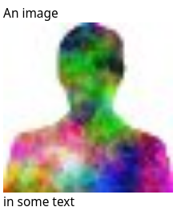

#### Text Decoration

| BBcode syntax                                                | Rendered text                     |
| ------------------------------------------------------------ | --------------------------------- |
| `[b]bold[/b]`                                                | **bold**                          |
| `[i]italic[/i]`                                              | *italic*                          |
| `[u]underlined[/u]`                                          | underlined                        |
| `[s]strike[/s]`                                              | ~~strike~~                        |
| `[color=red]red[/color]`                                     |              |
| `[hl]highlighted[/hl]`                                       |  |
| `[font=courier]some text[/font] `                            |            |
| `[quote]quote[/quote]`                                       |          |
| `[quote=Author]Author? Me? No, no, no...[/quote]`            |        |
| ` [size=small]small text[/size]` `[size=xx-large]xx-large text[/size]` ` [size=20]20px exactly[/size] 	` Size options include: **xx-small, small, medium, large, xx-large** |            |
| `Add a horizontal bar [hr] Like this 			`           |            |
| `This is [center]centered[/center] text`                     |        |

#### Code blocks 

Code can be rendered generically in a block or inline format (depending  on if there are new line characters in the text), or you can specify a  supported language for enhanced syntax highlighting. Syntax highlighting requires a suitable rendering plugin such as **hilite**. Supported languages with the hilite plugin include **php, css, mysql, sql, abap, diff, html, perl, ruby, vbscript, avrc, dtd, java, xml, cpp, python, javascript, js, json, sh** .  

 If a rendering plugin is not installed or an unsupported language is  specified, the output for syntax highlighted code blocks is the same as  the block format code tag. 

| BBcode syntax                                                | Output                                                       |
| ------------------------------------------------------------ | ------------------------------------------------------------ |
| `[code]function bbcode() { }[/code]`                         | `function bbcode() { }`                                      |
| `[code=php]function bbcode() {  $variable = true;  if( $variable ) {    echo "true";  } }[/code]` |                                       |
| `[nobb][nobb]This is how [i]you[/i] can  [u]show[/u] how to use  [hl]BBcode[/hl] syntax[/nobb][/nobb]` | This is how [i]you[/i] can [u]show[/u] how to use [hl]BBcode[/hl] syntax |

#### Lists

| BBcode syntax                                                | Rendered list                                                |
| ------------------------------------------------------------ | ------------------------------------------------------------ |
| `[ul] [*] First list element [*] Second list element [/ul]`  | - First list element - Second list element              |
| `[ol] [*] First list element [*] Second list element [/ol]`  | 1. First list element 2. Second list element            |
| `[list=A] [*] First list element [*] Second list element [/list]` 			The list type options are `1, i, I, a, A`. | A. First list element B. Second list element            |
| `[dl terms="b"] [*= First element term] First element description [*= Second element term] Second element description [/dl]` 			The **terms** style options can be any combination of:  bbold iitalic uunderline mmonospace llarge hhorizontal — like *this* defintion list | First element term First element description  Second element term Second element description |

#### Tables

| BBcode syntax                                                | Rendered table              |
| ------------------------------------------------------------ | --------------------------- |
| `[table border=0] [tr] [th]Header 1[/th][th]Header 2[/th] [/tr] [tr][td]Content[/td][td]Content[/td][/tr] [tr][td]Content[/td][td]Content[/td][/tr] [/table]` |  |
| `[table border=1] [tr] [th]Header 1[/th][th]Header 2[/th] [/tr] [tr][td]Content[/td][td]Content[/td][/tr] [tr][td]Content[/td][td]Content[/td][/tr] [/table]` |  |
| `[table] [tr] [th]Header 1[/th][th]Header 2[/th] [/tr] [tr][td]Content[/td][td]Content[/td][/tr] [tr][td]Content[/td][td]Content[/td][/tr] [/table]` |  |

#### Links and Embedded Content

| BBcode syntax                                                | Output                                                       |
| ------------------------------------------------------------ | ------------------------------------------------------------ |
| `[video]video URL[/video] [audio]audio URL[/audio]`          | VIDEO AUDIO                                             |
| `[video='URL_TO_POSTER']video_link[/video]`                  |  |
| `[url=https://hubzilla.org]Hubzilla[/url]`                   | [Hubzilla](https://hubzilla.org)                             |
| `An image [img]https://example.org/image.jpg[/img]  in some text ` |   |

#### Hubzilla spezific codes

| BBcode syntax                                                | Output                                                       |
| ------------------------------------------------------------ | ------------------------------------------------------------ |
| Magic-auth version of [url] tag 			`[zrl=https://hubzilla.org]Identity-aware link[/zrl]` |                                     |
| Magic-auth version of [img] tag 			`[zmg]https://hubzilla.org/some/photo.jpg[/zmg]` | Image is only viewable by those authenticated and with permission. |
| Observer-dependent output:`[observer=1]Text to display if observer IS authenticated[/observer]` |                                                              |
| ` [observer=0]Text to display if observer IS NOT authenticated[/observer]` |                                                              |
| `[observer.language=en]Text to display if observer language is English[/observer]` |                                                              |
| `[observer.language!=de]Text to display if observer language is not German[/observer]` |                                                              |
| `[observer.url]`                                             | channel URL of observer                                      |
| `[observer.baseurl]`                                         | website of observer                                          |
| `[observer.name]`                                            | name of observer                                             |
| ` [observer.webname]`                                        | short name in the url of the observer                        |
| `[observer.address]`                                         | address (Nomad/Zot-id) of observer                           |
| `[observer.photo]`                                           | profile photo of observer                                    |
| `What is a spoiler? 				[spoiler]Text you want to hide.[/spoiler]` | What is a spoiler? Click to open/close                       |
| `[toc data-toc='div.page-body' data-toc-headings='h1,h2']`  Create a table of content in a webpage or wiki page. Please refer to the [original jQuery toc](http://ndabas.github.io/toc/) to get more explanations.  	Optional param: 'data-toc'. If omitted the default is 'body' 	Optional param: 'data-toc-headings'. If omitted the default is 'h1,h2,h3' |                                                              |
| `[rpost=title]Text to post[/rpost]`  The observer will be returned to their home hub to enter a post with the specified title and body. Both are optional | [[baseurl\]/rpost?f=&title=title&body=Text+to+post](file:///home/daniel/Fediverse/orig doc/member/[baseurl]/rpost?f=&title=title&body=Text+to+post) |
| This requires the [**qrator**](https://framagit.org/hubzilla/addons/tree/master/qrator) plugin. `[qr]text to post[/qr]` |                                   |
| This requires a suitable map plugin such as **[openstreetmap](https://framagit.org/hubzilla/addons/tree/master/openstreetmap)**. 			`[map]` | Generate an inline map using the current browser coordinates of the poster, if browser location is enabled |
| This requires a suitable map plugin such as **[openstreetmap](https://framagit.org/hubzilla/addons/tree/master/openstreetmap)**. 			`[map=latitude,longitude]` | Generate a map using global coordinates.                     |
| This requires a suitable map plugin such as **[openstreetmap](https://framagit.org/hubzilla/addons/tree/master/openstreetmap)**. 			`[map]Place Name[/map]` | Generate a map for a given named location. The first matching location  is returned. For instance "Sydney" will usually return Sydney, Australia and not Sydney, Nova Scotia, Canada unless the more precise location is specified. It is highly recommended to use the post preview utility to  ensure you have the correct location before submitting the post. |
| `[©]`                                                        | ©                                                            |