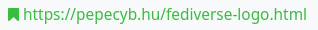
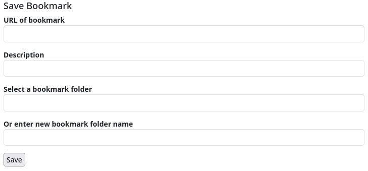

### Bookmarks

Bookmarks specify a link that can be saved in your bookmarks folder. They use the character string `#^` followed by the link. These are often generated automatically. If the administrator of the Hub has installed the ‘bookmarker’ add-on, this sequence is converted into a bookmark symbol when the post or comment is viewed online.




If you click on the icon, the bookmark is saved. If the bookmark add-in is not installed, the post drop-down menu contains a link to save the bookmark or bookmarks.

To use bookmarks, you must install the ‘Bookmarks’ app.

The app will then list all the bookmarks you have set.

To add a bookmark independently of a link in the stream or a post, you can call up the page `<URL_your_hub>`/rbmark, which provides you with a mask for manually entering a bookmark.



You can also create a [bookmarklet](https://en.wikipedia.org/wiki/Bookmarklet) and place it in the bookmark bar of your web browser, for example:

```javascript
javascript:javascript:(function(){var%20url=location.href;var%20title=document.title||url;window.open('[observer.baseurl]/rbmark?&url='+encodeURIComponent(url)+'&title='+encodeURIComponent(title)+'&source=bookmarklet','_blank','menubar=no,height=390,width=600,toolbar=no,scrollbars=no,status=no,dialog=1');})();
```

<u>Important:</u> Replace the expression `[observer.baseurl]` with the URL of your hub, e.g. if you have your channel on Klackerhub, you simply have to enter `https://klacker.org` for `[observer.baseurl]`.

Now you can add any website you visit to your channel's bookmarks by clicking on the bookmarklet.
