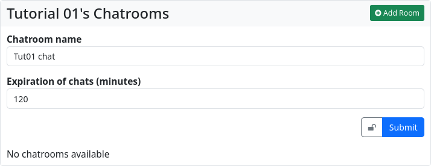
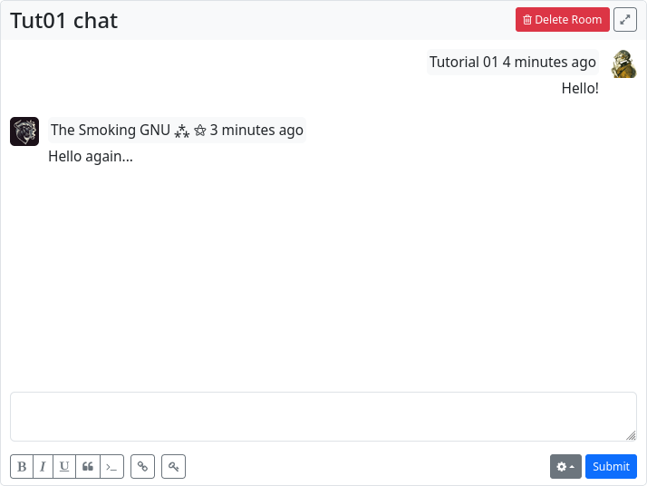

#### Chat Rooms

The ‘Chat Rooms’ app allows you to set up chat rooms for instant messaging within a hub and to chat with other channels within the hub.

If you access the app from the app menu, your own chat rooms will be displayed.
To create a new chat room, click on the ‘Add Room’ button.

Here you have to give the chat a name and you can choose how many minutes the chat content will expire after. It is also possible to use the [privacy tool](permissions_content.md) (🔒) to determine who is authorised to see and use the chat room.
The URL to the chat room is displayed in the browser and is also available via the link to the chat room in the left sidebar. Now you can share the URL with another user in your hub and start a chat with them.

