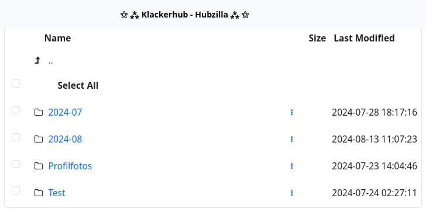
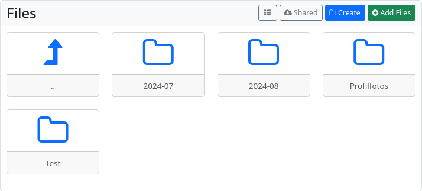
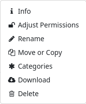

### Files

Hubzilla provides cloud functionality. This means that you have a directory for each channel in which you can create further subdirectories and store files. You can define precise access rights for each directory, and even for each individual file. These can range from visibility for the general public, to visibility for members of certain groups, to individual approval for individual members of your own connections. It is even possible to share files with people who do not have a Hubzilla identity. This is done using guest access tokens.

Creating and deleting directories and creating and deleting files is really easy.
You can access your cloud storage via the ‘app menu’ (⋮) → Files. You can also upload images via the files section, which is also possible via the ‘Photos’ section.

The files can be displayed in a list view

or in a tile view

You can create new directories/folders with the ‘Create’ button. When creating a folder, you can also immediately define the [permissions for](permissions_content.md) the new folder (🔓).

With the ‘+ Add files’ button, you can upload files to your cloud. Here, too, you can set the access permissions directly.

To set or change access rights (permissions) for directories or files at a later time, click on the context menu (︙) of the file or directory. You can also perform various file operations here.

If you attach a file using the ‘📎’ button when creating a post or comment, this file will be stored in a new directory (sample: `year-month`) in the cloud, if one is created.