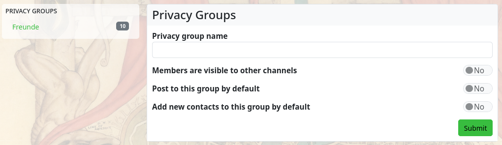
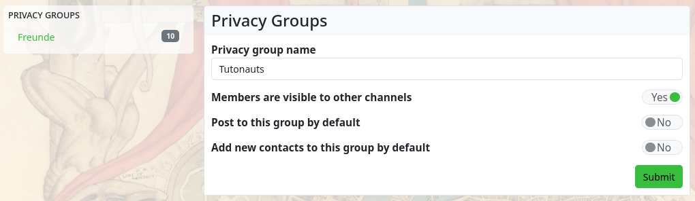
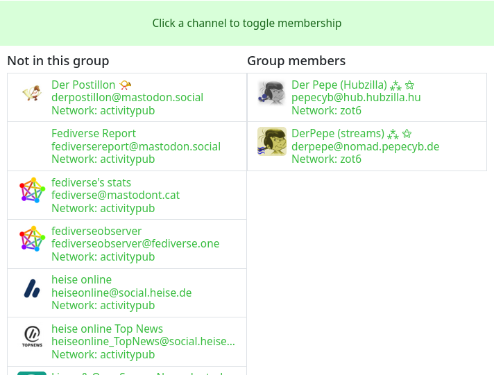

### Privacy Groups

The ‘Privacy Groups’ app allows you to create groups to which you can assign contacts. On the one hand, they serve to filter the stream (so you can only display posts from users who are in a privacy group) and, on the other hand, they allow you to grant certain groups rights to content with regard to [permissions](permissions_contact_roles.md).

The first function is easy to understand. If you have contacts (a contact can be in several groups) in a group and you select a specific group in the left sidebar in the stream view, only posts from contacts in that group will be displayed. This function thus acts as a stream filter.

The second function is also easy to grasp, but rather unusual for many Fediverse users, since it only exists in this form in Hubzilla and related services (Streams, Friendica etc.). As the name ‘Privacy Groups’ suggests, this is also about restricted communication. If you select a group as the authorisation when composing a post, the post is only distributed to the contacts contained in that group and only they can see it. It is also not possible for the recipients (group members) to share such a post publicly. This allows for closed group communication.

When you open the app, existing groups are displayed in the left sidebar and the input form for creating a new group is displayed in the main view.

If you select one of the groups in the sidebar, you can edit it.

Membership for contacts can also be set here. Clicking on an entry toggles the membership between ‘Not in group’ and ‘Group membership’. This way, you can remove members from a group or add users as group members.
Adding a contact to a group can also be done in the ‘Connections’ app using the contacts tool:

To add a new group, click on the ‘+ Add new group’ entry in the sidebar.