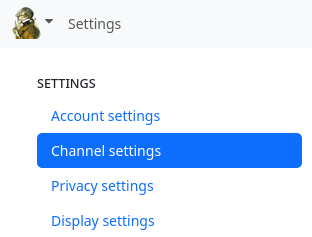

### Settings

Hubzilla allows a wide range of settings for behaviour, appearance, features, channels, etc.
You can access most settings via the main menu, where you will find the Settings menu item.

Various categories of settings are provided:

- Account settings
- Channel settings
- Privacy settings
- Display settings
- Manage locations - if clones of your channel exist

If you are in the stream view, you will see a small cogwheel (⚙) next to the main menu, which you can use to access the

- stream settings

There are also hidden settings

- Additional functions

which you cannot access via the menu or an icon.