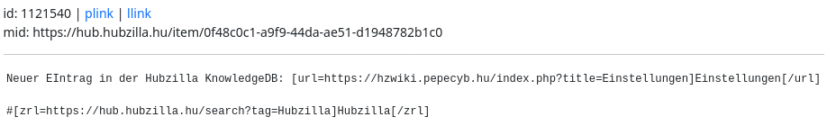

#### Show source code 

You can use this function to display the source code of a post. The content is therefore not rendered in formatted form, but includes the text including all markup tags (Markdown, bbCode, HTML).
The function therefore seems to be more for advanced or very curious users.

However, it does contain a feature that can be helpful for everyone.

In addition to the internal post ID, there are two hyperlinks: ‘plink’ and ‘llink’.

‘plink’ means “permalink” and corresponds to the [link to the source](link_to_source.md).
‘llink’ means “local link” and refers to the location of the post on your own instance (hub). Clicking on it does not cause you to leave your own instance, but displays the post in the single view.