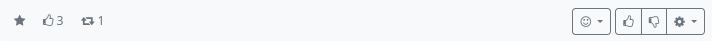

#### Toggle Star Status 

Switching the marking star should not be confused with ‘starring’ (= favouriting) other feed services (e.g. Mastodon). While ‘starring’ in these services represents a positive evaluation of the post, which corresponds most closely to a ‘link’, marking with a star in Hubzilla is comparable to setting a bookmark. By toggling (one click sets the star, another removes it again), the post is set as a kind of bookmark for the user.
You can recognise a ‘starred’ post by the star symbol at the bottom left.

In the stream view, you will find the entry ‘Marked posts’ in the left sidebar. If you click on it, all marked posts are displayed in (reverse) chronological order in the stream.