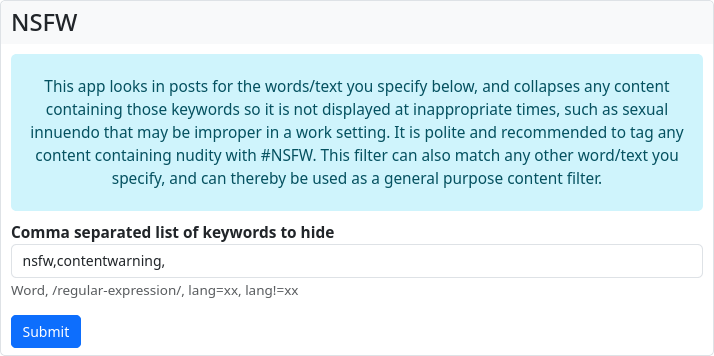
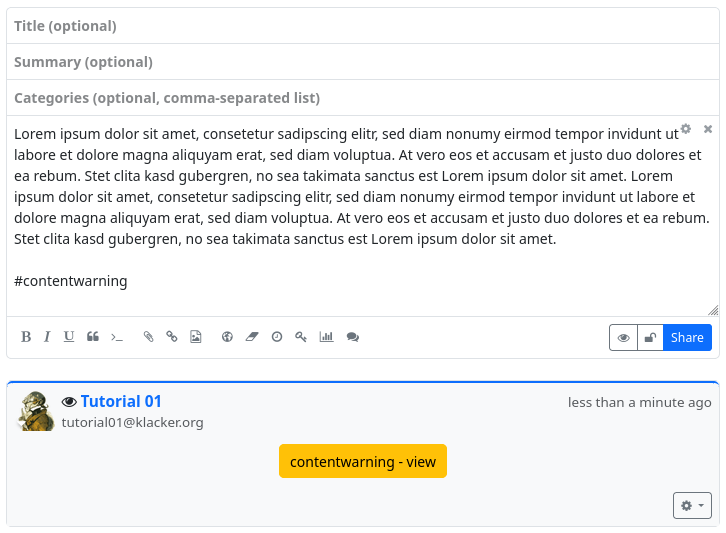
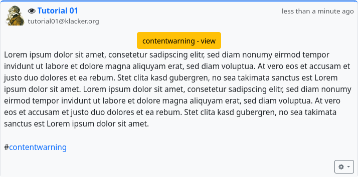

### Content warning/NSFW

Content warnings and hiding certain content is done with Hubzilla using the ‘NSFW’ app.
While with other services in the Fediverse you have to rely on the authors of posts possibly hiding ‘sensitive’ content behind a content warning (a content or trigger warning), with Hubzilla you have this functionality in your own hands as a recipient. With the NSFW app, you can create filters that ensure that posts that match the filter rules are collapsed. The content of the post is only displayed when you click on the button.

Here you can enter keywords and even [regular expressions](https://en.wikipedia.org/wiki/Regular_expression) that the posting will be searched for. If one of the words or a text pattern is found, the content in the stream will be collapsed.
It is also possible to filter by language (lang=xx or lang!=xx).
If a phrase that matches one of the filters entered is found in a posting, the posting will initially be hidden from you behind a content warning.

