#### Additional features (hidden settings)

The ‘Additional Features’ settings are not accessible in their entirety either via the menu or via an icon. However, all the individual feature settings can also be accessed in the respective app via the cogwheel next to the main menu (avatar picture).
These are settings for additional functions in all possible areas of Hubzilla. To access the settings, you have to append the URL of the hub `/settings/features` to the browser, e.g. `https://klacker.org/settings/features`.

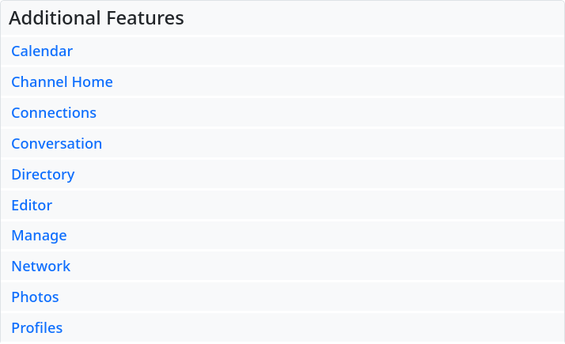

The default settings for all of these options are set by the hub administrator. This default setting can be overridden by the user in the ‘Additional Functions’.
For each option, the administrator also has the option of locking the default setting to prevent changes. The user can still flip the switch for the option, but the selection is not saved and the option is reset to the default setting.

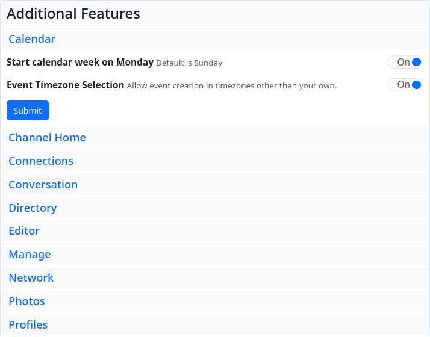

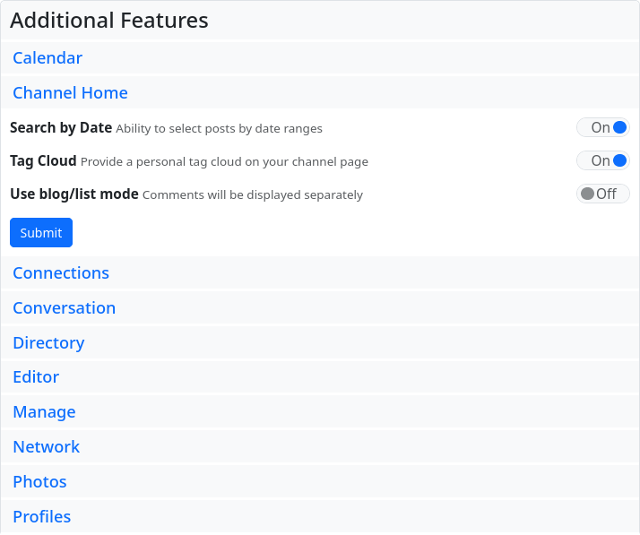

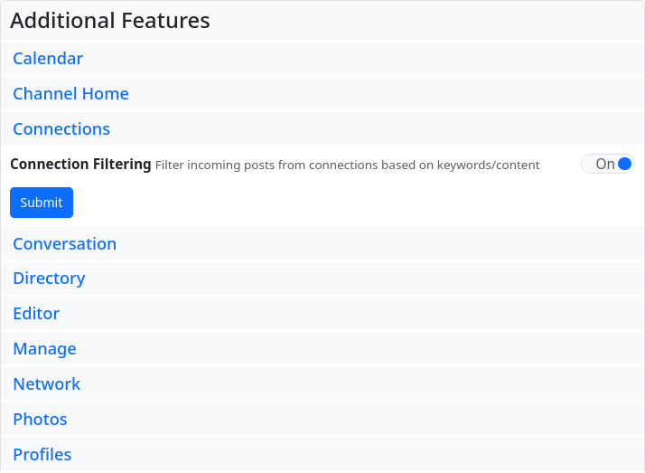

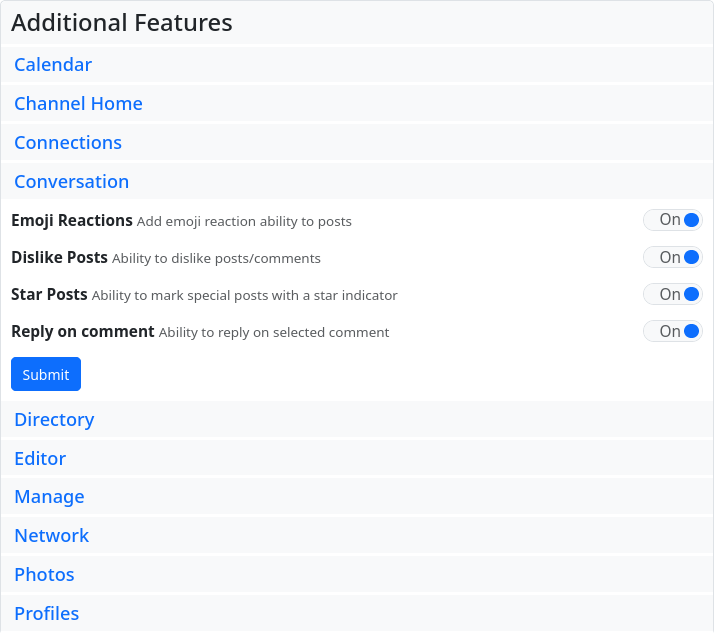

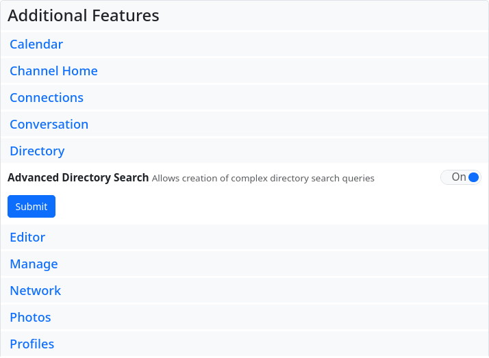

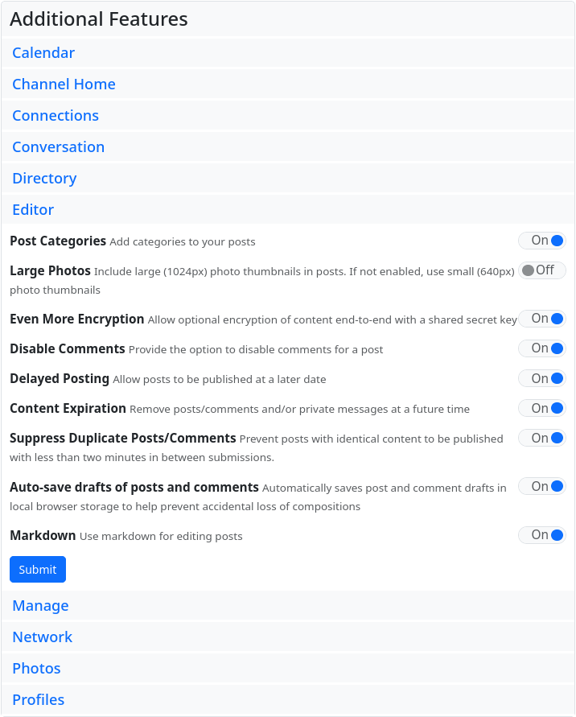

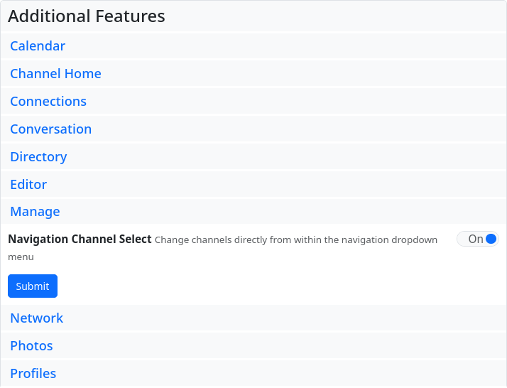

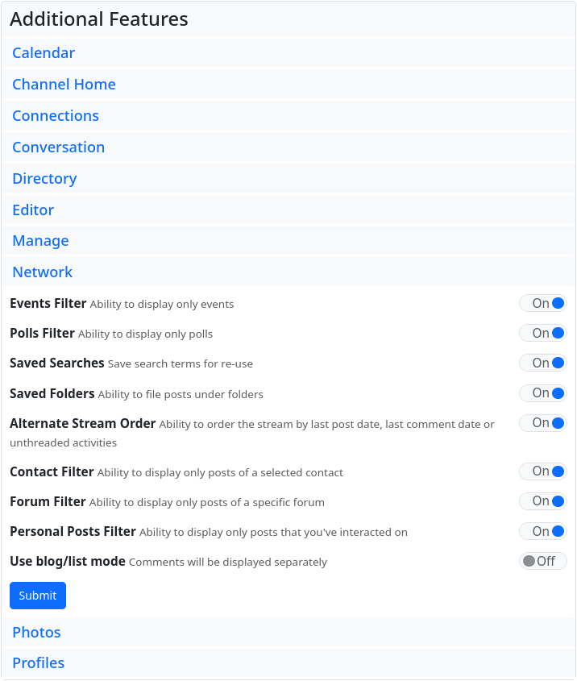

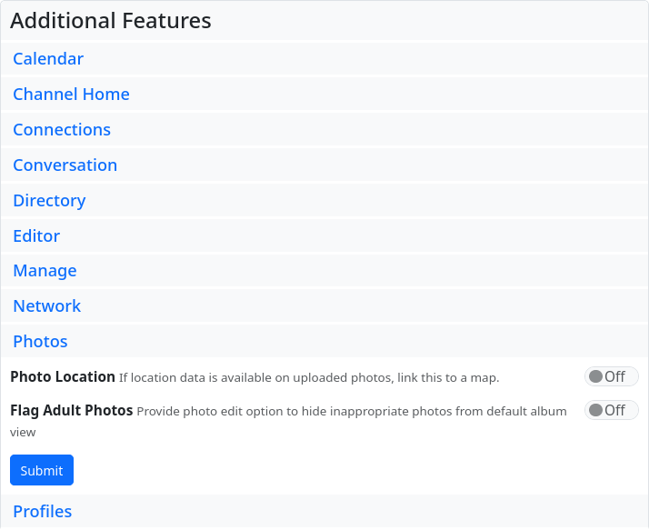

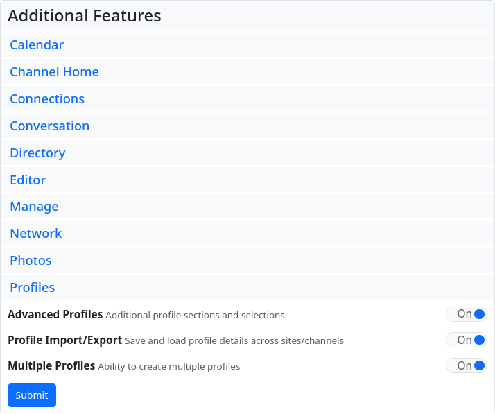