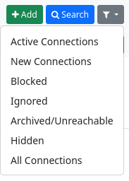

### Blocking/ignoring/archiving/hiding channels   

Channels in your address book can have the status ‘ *blocked*’, ‘ *ignored’,*‘ *archived’* or ‘ *hidden’*. There is a filter on your connection page that displays the channels with these statuses.

You can change the status of a channel on the pages for editing connections.

The meaning:

**Blocked:** The channel cannot read your items, regardless of permissions, and it cannot write to your channel.

**Ignored**: The channel can read your items if it is authorised to do so, but it cannot write to your channel.

**Hidden:** The channel is not displayed in the connection list of your profile. No one can see that you are connected to it. Note: It is still visible to your other connections, for example in replies to posts.

**Archived:** If a channel cannot be reached for 30 days, it is automatically marked as archived. This means that all data is retained, but the channel is no longer queried for new information and is removed from the auto-complete. If you find out later that the channel is online again, you can remove it manually from the archive.