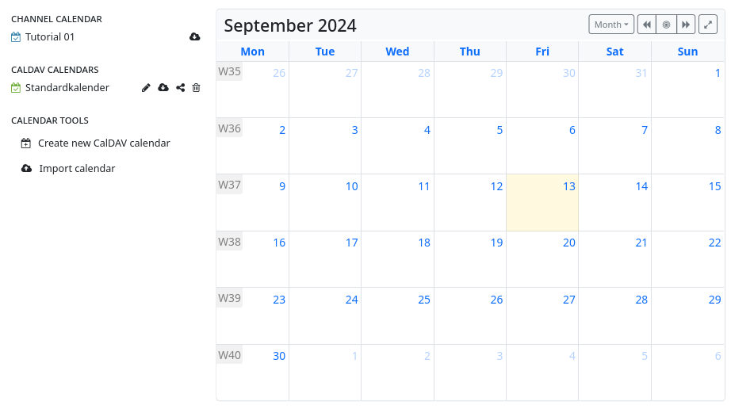
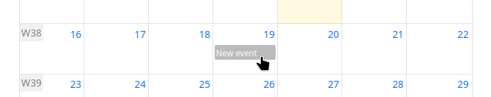
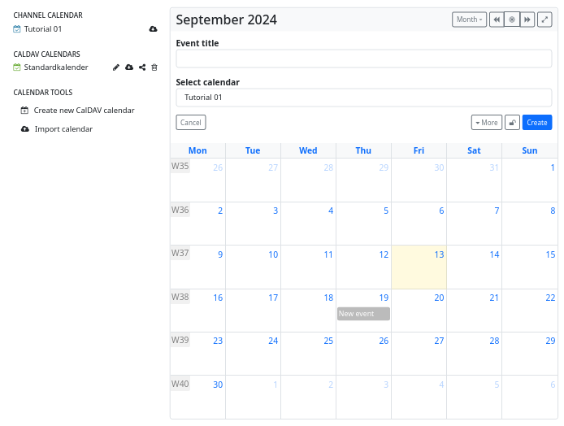
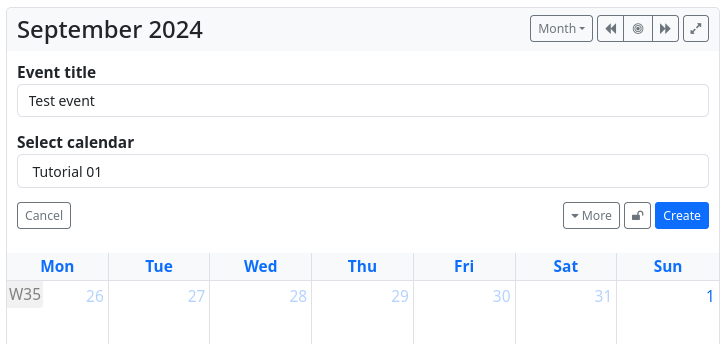

### **Calendar**

The ‘Calendar’ app can be used to manage appointments.
After opening the app, a calendar overview (one month) is displayed.

Clicking on a day allows you to create an event. In the  input mask (shortened view, can be expanded by clicking on ‘more’ ) you can now enter the essential contents.

You may also define detailed [permissions](permissions_content.md) for these entries, so that you can record private appointments and public/shared appointments in one and the same calendar.

##### **CalDAV access with Android** 

You can synchronise your Android calendar with your hub.
Use the ‘URL’ and ‘Username’ to log in. The base URL is `<your-hub-URL>/cdav`, and the username is your channel name (without the leading ‘@’ and without the hub address ‘`@<your-hub>`’).
To share your calendar, visit `<your-hub-URL>/cdav/calendar`.