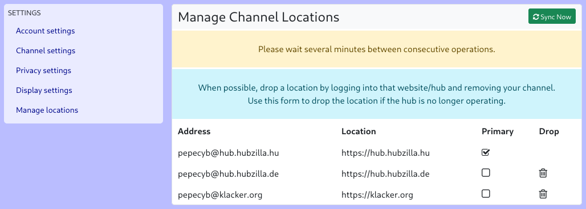

#### Manage Channel locations

If the current channel has clones on other hubs, the menu will show an additional entry, ‘Manage Channel locations’. This allows you to specify the hub on which the main channel (primary channel) is located (this also determines the part of the handle after the ‘@’).
You can also delete clones from here. However, for channels on third-party servers, it is recommended that you delete the channel on the actual hub. Deleting from the clone management should only be used if the clone's hub no longer exists.

