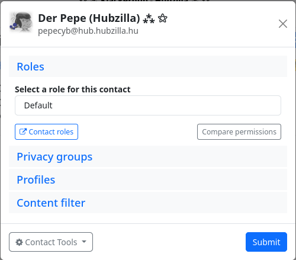
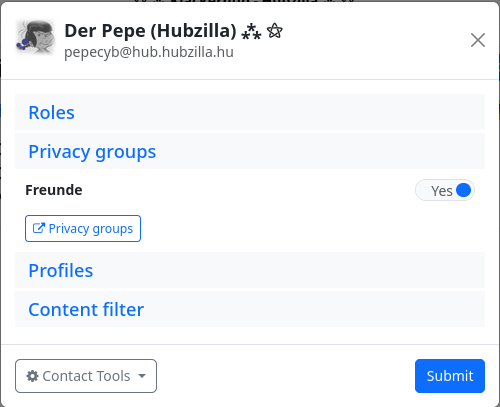
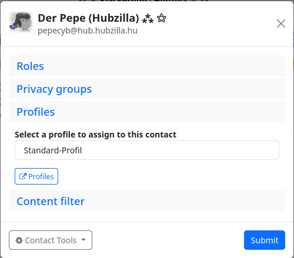
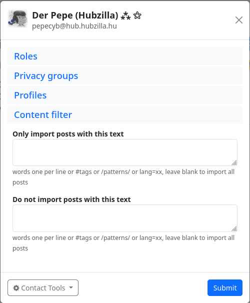
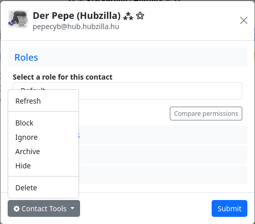

#### Connection editor 

If you click on the ‘Edit’ button for a contact in the ‘Connections’ app, the connection editor opens.
You can use the editor to assign a specific contact role to a contact. If required, you can use the ‘Contact Roles’ button to display the existing roles and also create new roles. Another button (Compare authorisations) allows you to compare the assigned authorisations with those of the standard authorisation role.

You can use the ‘Privacy groups’ tab to assign a contact to one or more privacy groups.

You can use the ‘Profiles’ tab to specify which of your profiles (if you have created several) is displayed to the contact.

With the content filters, you can filter out posts from a contact with certain content or use filters to specify that only posts with defined content end up in the stream.

You can use the contact tools to

- block the contact,
- ignore,
- archive,
- hide

or

- delete.

