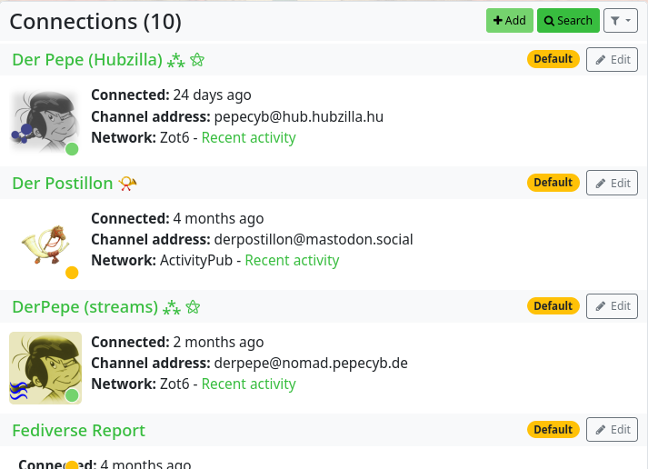

### Connections 

You can use the ‘Connections’ app to display all your connections.

In the overview, for each connection

- the channel name
- the date of the connection
- the channel address (handle)
- the network of the contact (ActivityPub, Zot (Nomad), RSS, Diaspora...)
  - you can use a filter next to it to display the channel's recent activities in the stream
- the profile picture
- and a coloured dot (traffic light colours) indicates the rights granted by the contact (if you rest the mouse pointer over the coloured dot, the rights granted are displayed)

can be seen.

A label is also displayed which shows the type of connection or warns that (in the case of clones) there is no connection at this location.
There is an ‘Edit’ button on the right of each contact entry, with which you can edit the connection using the connection editor.