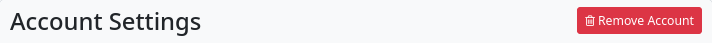

### Deleting your account

If you wish to delete your account, i.e. all access to the hub, use the settings in the main menu (top left; profile picture): Settings → Account settings.

At the top of the page, you will see a button labelled ‘Remove account’. Click on it and your account (account) will be deleted, including all content, after you enter your account password (for security purposes).

