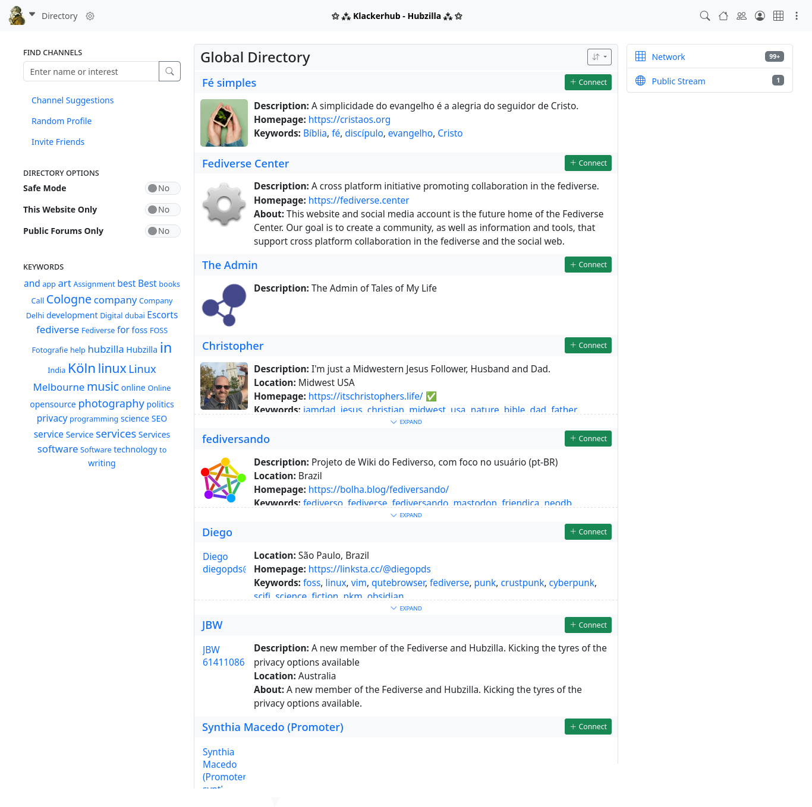

### Directory

Hubzilla offers a channel directory via the app (in the app menu ⋮). The Hubzilla Grid channels are listed in the directory.

The directory options in the left sidebar can be used to filter the scope of the directory. For example, you can restrict the listing to channels from your own hub.

There is also a keyword cloud in the left sidebar, which you can use to find channels with corresponding interests/focal points.

There is also a search field in the left sidebar to find channels by name / name components or interests (keywords).

You can then connect directly to a channel found by clicking on the corresponding button.
