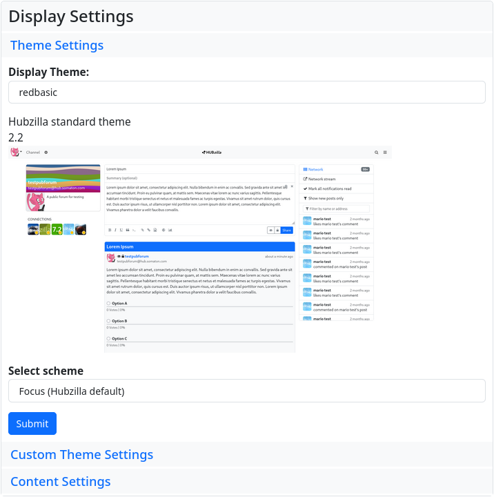
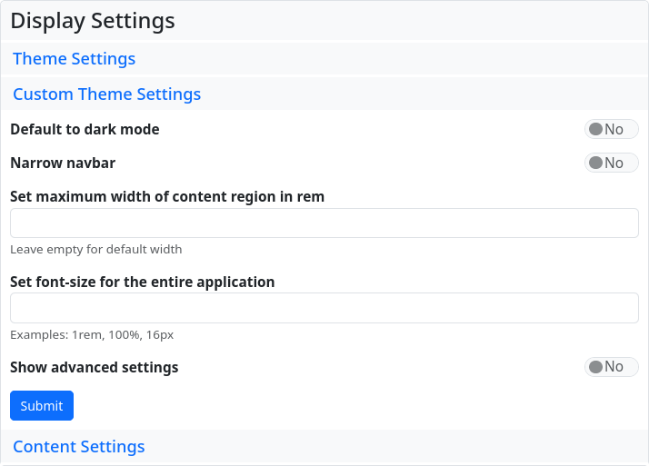
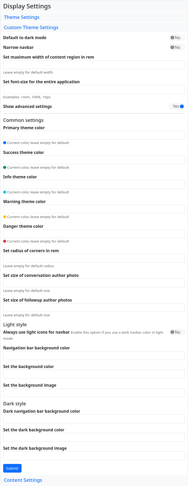

#### Display settings

The display settings can be used to customise the design of the channel. In addition, you can determine which content is displayed, within certain limits.
In the design settings, you can select from the installed themes and set your design scheme for the topic.

With the custom design settings, it is possible to adjust the colour scheme to your own preferences and to define corner rounding, standard sizes and standard dimensions for avatars. The default settings are initially displayed in simplified form, and only allow you to set the dark mode, choose a narrow navigation bar, set the width of the content area and adjust the font size.

If you set the ‘Show advanced settings’ switch to ‘Yes’ and submit the selection, the advanced settings will be displayed, where you can set colours, avatar dimensions and background images.

The content settings allow you to select various parameters (e.g. the time until the view is updated) and to switch off the display of the ‘links for new members’ that are displayed when new channels are created.

