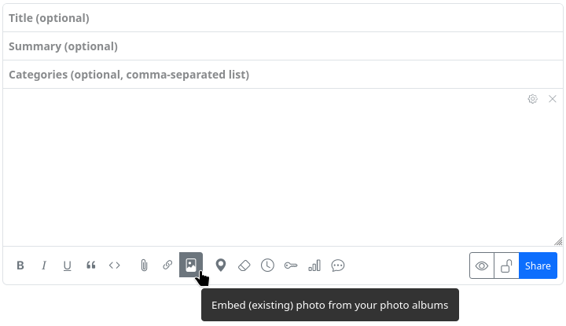
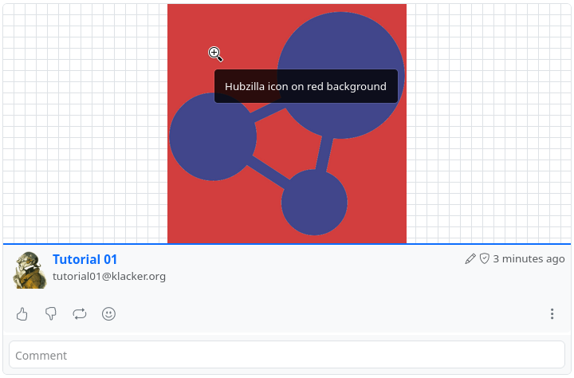

#### Insert images

There are various ways to insert images into posts and comments.

##### In the post editor 

There are two buttons in the post editor that allow you to insert images: ‘Embed image’ and ‘Attach/upload file’.

With ‘Embed image’, you can insert an image that already exists in the cloud into the post. The image must therefore either be available or you can upload it for precisely this purpose, e.g. using the ‘Files’ app.

If you select this button, an overview of the available image files opens and you only have to select and click on the appropriate image. Please note: After selecting the image to be inserted, the selection window must be closed again. It does not close automatically after inserting an image so that you have the option of inserting several images in one go. 

Once selected, the image, scaled to its original size, is inserted as a clickable link to the source file using the bbCode tags `[zrl][zmg][/zmg][/zrl]` at the end of the previous post (not at the current text cursor position).

With ‘Attach/upload file’ an image can be uploaded directly from your own device and embedded at the end of the post.

A file selection dialogue opens where you can select and upload the image on your own device. It is uploaded to an automatically created subdirectory in the cloud and inserted at the end of the previous post using the bbCode tags `[zrl][zmg][/zmg][/zrl]`.

<u>Please note:</u> With this method, the image is not scaled to its original size but displayed as a smaller preview image if there is no continuous text. As a result, you may see a chequered background around the image.

##### In the comment editor 

The comment editor only offers the option of uploading and embedding an image. The button for inserting an existing image does not exist there.

If you still want to insert an existing image, you must do this manually using the tags `[img][/img]` or `[img=URL][/img]`. To do this, you need to know the URL of the image. In this way, you can also insert images from external sources on the web.

If you use `[img=WIDTHxHEIGHT][/img]`, you can scale the image.

##### Alt text 

If you want an alternative text (alt text) to be displayed when the image cannot be displayed or - as a pop-up - when you move the mouse pointer over the image, you can place it between the two tags `[img=URL]ALT_TEXT[/img]`. If you have embedded the image in a post using the first method (‘Embed image’), you have to do it yourself. You have to replace the scaling that was inserted in the opening zmg tag with the URL of the image and replace the automatically inserted image URL between the opening and closing zmg tag with the alt text.

Example:

The image was embedded and the code
`[zrl=https://klacker.org/photos/tutorial01/image/cd747cd9-3f05-42cd-94cc-91c7368c5a18][zmg=520x520]https://klacker.org/photo/cd747cd9-3f05-42cd-94cc-91c7368c5a18-2.png[/zmg][/zrl]`
was created automatically, then it must be changed to insert the alt text ‘Hubzilla icon on red background’, for example:
`[zrl=https://klacker.org/photos/tutorial01/image/cd747cd9-3f05-42cd-94cc-91c7368c5a18][zmg=https://klacker.org/photo/cd747cd9-3f05-42cd-94cc-91c7368c5a18-2.png520x520]Hubzilla icon on red background[/zmg][/zrl]`

