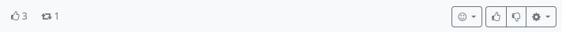
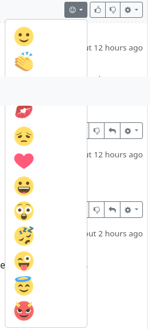
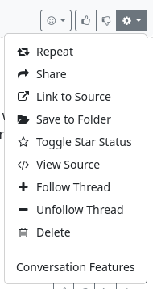

### Interact with posts 

You can interact with posts that you see in the stream. This is one of the purposes of social networks. You can comment on such a post, but there are also other ways of interacting.
The buttons for this can be found at the bottom right of the post.

You can ‘like’ 🖒 or ‘dislike’ a post 🖓 or you can react to a post with an emoji:

Further functions can be found in the ⚙ menu.

