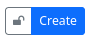
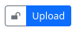
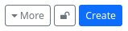
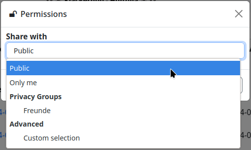
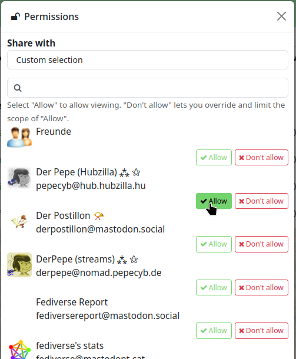

#### Permissions for content 

If you share content on Hubzilla, i.e. publish posts, upload images or texts, enter appointments in the calendar, you can define exactly who has access to this content.
You can access the permission settings for content via a button ("Privacy Tool") with a padlock symbol 🔒or 🔓.

For sharing posts: 

For creating folders/directories in the cloud storage: 

For uploading files: 

For sharing dates/events: 

There are also corresponding permission setting options for websites, wiki pages and various other content.

If you click on the icon, the permissions dialogue opens, which you can use to set the permissions for other users (this is usually about the visibility of content).

You have the choice between

- **Public** - As the name suggests, the content is visible to everyone on the Internet. So even for users who do not use a Fediverse service.
- **Only me** - Here, only the user who created the content can see it. They ‘share’ it with themselves.
- **Privacy groups** - The content is visible to all users who are in one of your privacy groups.
- **Customised selection** - Here you can specify exactly who can see the content. It is also possible to combine privacy groups and individual contacts by selecting ‘Allow’ or ‘Deny’ for the respective entry.

----

**Important note:**
Once permissions for postings have been set, they can no longer be changed! A posting is immediately distributed to an indeterminable number of other servers, so that permissions cannot be subsequently granted or withdrawn, whereas permissions for other content such as files, images, etc. can be subsequently edited because this content is only stored on your own instance (hub) and only the reference to the content is passed on when it is shared.