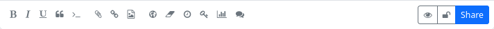

### Posting 

If you would like to write and share a post (publish, although the circle of recipients or those who can see the post may be restricted), you can usually do this via the ‘Share’ field located above the stream. Click on this field to open the post editor.

At the top is the field for the post title (optional), below this is the field for the summary (also optional), if the administrator of your hub allows this function. The summary can also be used for the purpose of a content warning. Below the field for the summary is a field for categories (if activated by the admin). 
Below this is the text field in which you can create the post content. Depending on the Hub settings, you can use plain text, Markdown, bbCode or HTML for formatting the text.

At the bottom of the post editor there are some buttons for easier formatting of the content and for inserting elements and using additional functions: bold, italic, underline, quote, code, attach/upload file, insert link, insert image (an image that already exists under Files), insert location, set expiry date for the post, set publication date, encrypt text, vote (poll) on/off, deactivate comments. To the right of this is another block with buttons. Here you can display a preview of the post, specify whether the post should be published on other networks, make the authorisation settings (who can see the post) and finally publish it using the ‘Share’ button.

You can also access the post editor by selecting the corresponding menu item in the app menu (top right ⋮) or the corresponding icon in the navigation bar (if you have pinned the ‘Write post’ app).