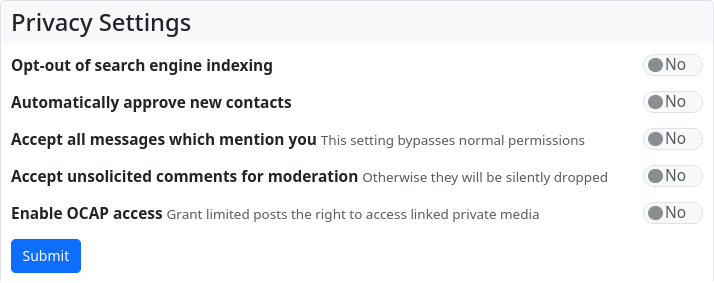

#### Privacy settings

In the privacy settings, you can determine whether your posts may be indexed by search engines, whether you accept contact requests automatically (without manual approval), whether all messages in which you are mentioned are automatically accepted, whether comments from users who are not among your contacts are submitted for moderation (approved/rejected) or deleted, and whether you allow OCAP access.

