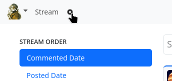
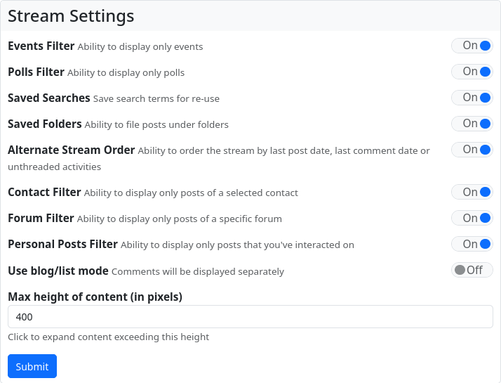

#### Stream settings

The stream settings are not accessed via Main Menu → Settings, but via the small cogwheel symbol (⚙) next to the main menu, which appears there as soon as you open the stream view.

The stream settings can be used to select the display of the stream and the features available there (e.g. stream filters, saving search queries, etc.).

