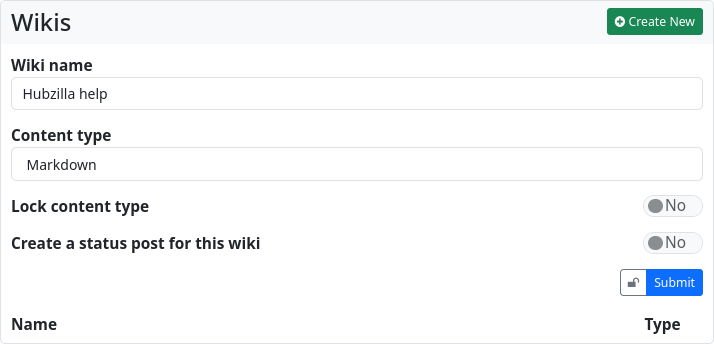

### Wikis

The ‘Wiki’ app makes it possible to create wikis in your own channel.
Wiki pages are not federated and remain on your own hub.

The wiki app offers simple, classic wiki functionality. Wiki posts can be created as plain text, Markdown text or BBcode text.

To view (or edit) a wiki, select the corresponding wiki from the list on this page.
If you want to create a new wiki, click on the button ‘+ Create new’.
An input form will open in which you enter the name of the wiki and define the content type (as standard). You can use a switch to determine that only the selected content type (text, Markdown, BBcode) must be used for all wiki entries. You can also use a switch to turn the creation of a status post about wiki creation on or off.

You can also set up detailed [permission rights](permissions_content.md) for a wiki.
Click on ‘Submit’ to create the wiki and open the home page.
The default view of a wiki page is always ‘View’, in which the text is rendered according to the source code. You can switch to the ‘Edit’ view using the tabs at the top to access the editor mode.
If you have edited the page and then switch back to View, the changes will be displayed immediately.
If you want to save the page, enter a suitable comment in the input field below the text and click on ‘Save’. The wiki page has been created.
Using the third tab, labelled ‘History’, you can view the changes made to the wiki page and, if you wish, undo changes. This is a wiki-typical form of version control.

As you create more wiki pages, they will be listed in the left sidebar, from where they can also be accessed.

For collaborative editing of a wiki, it is necessary to grant the users who are allowed to work on the wiki appropriate rights. In the case of a Public, Personal or Community Forum channel, this is done by means of a corresponding contact role in which the editing of the wiki pages is authorised. This permission is not granted by default for the channel roles mentioned (permission can be granted for a user-defined channel role, but it then applies generally and cannot be withdrawn again using a contact role).

If you want to exclude individual wikis from this, you must restrict their visibility via the permission settings of the wiki (padlock). 